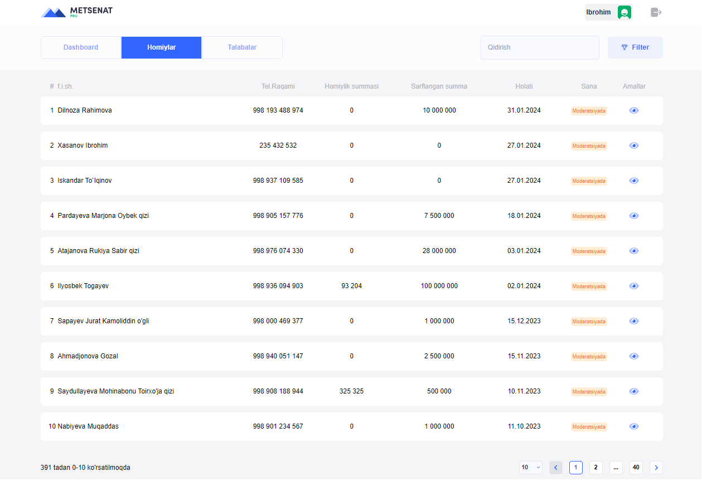

# #Metsenat-Club



### Metsenat Club prioritizes transparency and accountability in all interactions. We facilitate direct communication between sponsors and students, enabling them to establish meaningful connections and build supportive relationships. Sponsors can track the progress of their sponsored students and witness the transformative impact of their contributions firsthand.

## Recommended IDE Setup

[VSCode](https://code.visualstudio.com/) + [Volar](https://marketplace.visualstudio.com/items?itemName=Vue.volar) (and disable Vetur) + [TypeScript Vue Plugin (Volar)](https://marketplace.visualstudio.com/items?itemName=Vue.vscode-typescript-vue-plugin).

## Customize configuration

See [Vite Configuration Reference](https://vitejs.dev/config/).

## Project Setup

```sh
npm install
```

### Compile and Hot-Reload for Development

```sh
npm run dev
```
